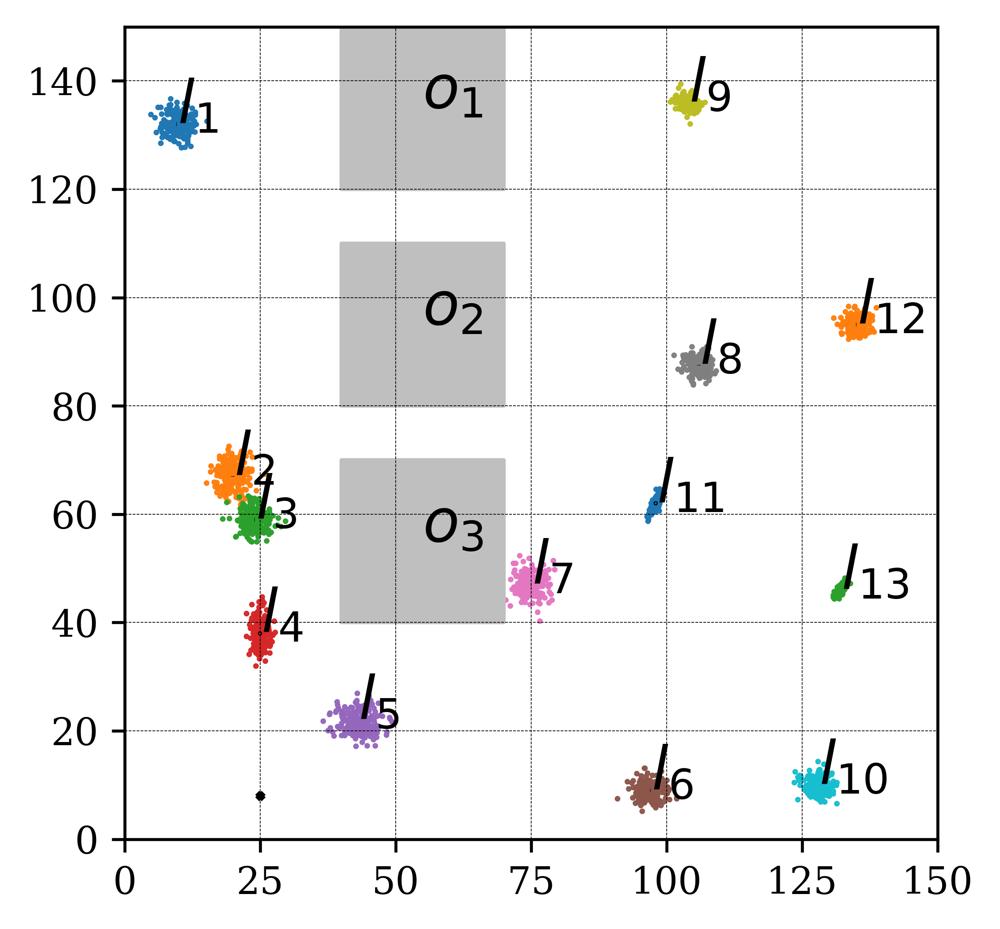

# TL-RRT*
Tasks specified by Linear Temporal Logic can capture more complex missions compared to traditional point-to-point navigation.
The majority of existing Linear Temporal Logic (LTL) planning methods rely on the construction of a discrete product 
automaton, that combines a discrete abstraction of robot mobility and a Büchi automaton that captures the LTL specification
We propose a new sampling-based LTL planning algorithm that does not require any discrete abstraction of robot mobility.
Instead, it builds incrementally trees that explore the product state-space, until a maximum number of iterations is
reached or a feasible plan is found. The use of trees makes data storing and manipulation tractable, which significantly
increases the scalability of our algorithm. To accelerate the construction of feasible plans, we introduce bias in the
sampling process which is guided by transitions in the Büchi automaton that belong to the shortest path to the accepting
states.

# Requirements
* [Python >=3.6](https://www.python.org/downloads/)
* [sympy](https://www.sympy.org/en/index.html)
* [re]()
* [Pyvisgraph](https://github.com/TaipanRex/pyvisgraph)
* [NetworkX](https://networkx.github.io)
* [Shapely](https://github.com/Toblerity/Shapely)
* [scipy](https://www.scipy.org)
* [matplotlib](https://matplotlib.org)
* [termcolor](https://pypi.org/project/termcolor/)
* [visilibity](https://github.com/tsaoyu/PyVisiLibity)

# Usage
## Structures
* Class [Task](task.py) defines the task specified in LTL
* Class [Workspace](workspace.py) define the workspace where robots reside
* Class [Landmark](workspace.py) define the landmarks in the workspace
* Class [Buchi](buchi_parse.py) constructs the graph of NBA from LTL formula
* Class [Geodesic](geodesic_path.py) constructs geodesic path for given environment
* Class [BiasedTree](biased_tree.py) involves the initialization of the tree and relevant operations
* Function [construction_biased_tree](construct_biased_tree.py) incrementally grow the tree
* Script [biased_TLRRT_star.py](biased_TLRRT_star.py) contains the main function
* Functions [path_plot](draw_picture.py) and [path_print](draw_picture.py) draw and print the paths, respectively
* Functions [export_disc_to_txt](draw_picture.py) and [export_cov_to_txt](draw_picture.py) export discretized waypoints and covariance at waypoints, respectively
* Functions [kf_update](kf.py) and [ekf_update](ekf.py) update position and cavariance using kalman filter and extended kalman filter respectively

## Basic procedure
* First, in the class [Workspace](/workspace.py) specify the size of the workspace, the layout of landmarks and obstacles, and the covariance associated with each landmark. Also specify the number of classes and the class distribution.
* Then, specify the LTL task in the class [Task](task.py), which mainly involves the assigned task, the number of robots, the initial locations of robots and the minimum distance between any pair of robots, and workspace in the class [Workspace](/workspace.py) that contains the information about the size of the workspace, the layout of regions and obstacles. If manual initiation is set to False, then the robots will be initated at random locations. 
* Set the parameters used in the TL-RRT* in the script [biased_tree.py](/biased_tree.py), such as the maximum number of iterations, the step size, sensor range, sensor noise. 
* If the output will be used by the simulation, the specify location of folder where the waypoints should be saved.
* Run [biased_TLRRT_star.py](/biased_TLRRT_star.py) to generate the solution.
* Finally, after the TL-RRT* terminates, the runtime and the cost of the solution are presented. What's more, the path composed of prefix and suffix parts for each robot is drawn with workspace layout when the number of robots is relatively small, otherwise, the path for each robot is printed onto the screen when the number of robots is large. 

# Example

## Workspace
The workspace of size `150 x 150` is shown below, with `l_1`-`l_13` being regions and `o_1`-`o_3` being obstacles
<p align="center">

</p>

## Test Cases
For all the following test cases, the same set of parameters are used.
```python
# parameters
# maximum number of iterations
n_max = 100000
para = dict()
# lite version, excluding extending and rewiring
para['is_lite'] = True
# step_size used in function near
para['step_size'] = 0.25 * buchi.number_of_robots
# probability used when choosing node q_p_closest
para['p_closest'] = 0.9
# probability used when deciding the target point 
para['y_rand'] = 0.99
# minimum distance between any pair of robots  
para['threshold'] = 1
# Updates landmark covariance when inside sensor range
para['update_covariance'] = True
# sensor range in meters
para['sensor_range'] = 10
# sensor measurement noise
para['sensor_R'] = 0.5
```
Furthermore, the construction of the tree terminates once an accepting node is detected, which is controlled in [construct_biased_tree.py](construct_biased_tree.py) by line
```python
if len(tree.goals): break
```
### Case 1
The task involving one robot is specified by 
```python
self.formula = '<> e1  && <> ( e2 && <> e3) && !e4 U e1' 
self.subformula = {2: ['(l11_1)',0,0.8,1.5, 0],
                    3: ['(l9_1)',0,0.8,1.5, 0], 
                    1: ['(l13_1)',0,0.8,3, 0], 
                    4: ['(l11_1)',0,0.8,5, 0]
                    }
robot_initial_pos = ((25,80),)  # in the form of ((x,y), (x,y), ...)    
```
The output results during execution are
```
Time for the prefix path: 0.0066 min
Cost of path: 228.00000000000003
```

### Case 2
The task involving two robots is specified by 
```python
self.formula = '<> e1  && <> e2 && <> e3 && !e2 U e1' 
self.subformula = {1: ['(l1_1)',0,0.8,1.5, 0],
                    2: ['(l6_2)',0,0.8,1.5, 0], 
                    3: ['(l2_1 && l10_2)',0,0.8,3, 0], 
                    4: ['(l11_1)',0,0.8,5, 0]
                    }
robot_initial_pos = ((25,80),(10,8)  # in the form of ((x,y), (x,y), ...)    
```
The output results during execution are
```
Time for the prefix path: 0.0995 min
Cost of path: 229.45128947213922
```

### Case 3
The task involving five robots is specified by 
```python
self.formula = '<>e1 && <> ( e2 && <> e3) && []!e4'
self.subformula = {1: ['(l1_1 && l3_2 && l7_4 && l10_5)',0,    0.7,    1.5, 0],
                    2: ['(l9_1 && l11_2 && l8_3)',  0,    0.7,    1.5,  0],
                    3: ['(l8_1 && l7_2 && l2_3 && l5_4 && l12_5)', 0,    0.7,   1.5,  0],
                    4: ['(l13_1 || l13_2 || l13_3 || l13_4 || l13_5)', 0,    0.7,    5,  0]
                    }
robot_initial_pos = ((25,80),(10,8),(15,8),(20,8),(25,8))
```
The output results during execution are
```
Time for the prefix path: 0.2149 min
Cost of path: 535.7794199619735
```
